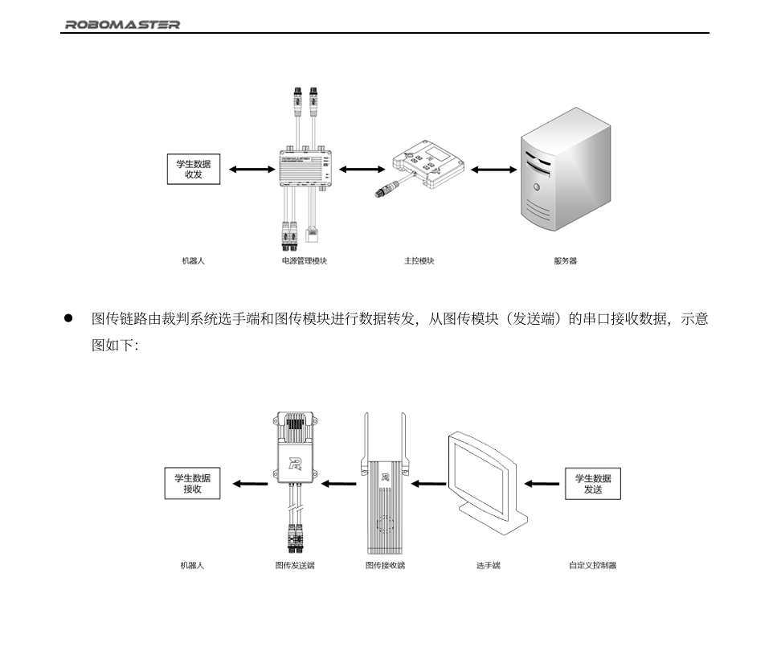

# 裁判系统
## 数据基础

在赛场上我们控制机器人有两大部分：数据层、函数块，我们首先来说前者，数据层在实物连接上是怎么进行数据传输，传的又是什么数据呢？等等。
1. 数据分类
传的数据分为两大类：常规链路和图传链路。
前者传输的主要HP等基础数据，这些数据只是作为一个内置的数据；后者是我们遥感控制机器人的数据。你可以简单认为前者是你打王者时的基础数据，比如你的血量、蓝量、物攻、法抗等等，而后者是你控制的moba数据，释放技能、遥感等等
2. 数据传输
我们首先明确一个点，通信的不同方式，在这里我们使用的UART，异步串口通信，对于异步通信的通信规则，我们最基础需要使用ID，这是因为时钟频率不一致的情况下，没有一个准确获取数据的能力，于是聪明的开发者使用ID的形式让数据能够正常被所想要的接收者接收，以上也说了最基础，那么更高一个层级，我们增加了seq和crc  

## 代码
1. class
在referee的类中，我们来看它定义了什么内容
```
void Init(UART_HandleTypeDef *huart, uint8_t __Frame_Header = 0xa5);

    inline Enum_Referee_Status Get_Referee_Status();
    inline Enum_Referee_Game_Status_Type Get_Game_Type();
    inline Enum_Referee_Game_Status_Stage Get_Game_Stage();
    inline uint16_t Get_Remaining_Time();
    inline uint64_t Get_Timestamp();
    inline Enum_Referee_Game_Result Get_Result();
    inline uint16_t Get_HP(Enum_Referee_Data_Robots_ID Robots_ID);
    inline Enum_Referee_Data_Status Get_Event_Supply_Status(uint8_t Supply_ID);
    inline Enum_Referee_Data_Status Get_Event_Energy_Status();
    inline Enum_Referee_Data_Status Get_Event_Energy_Small_Activate_Status();
    inline Enum_Referee_Data_Status Get_Event_Energy_Big_Activate_Status();
    inline Enum_Referee_Data_Status Get_Event_Highland_Status(uint8_t Highland_ID);
    inline uint32_t Get_Event_Base_Shield_Remain_HP();
    inline uint8_t Get_Supply_ID();
    inline Enum_Referee_Data_Robots_ID Get_Supply_Request_Robot();
    inline Enum_Referee_Data_Event_Supply_Status Get_Supply_Request_Status();
    inline Enum_Referee_Data_Event_Supply_Ammo_Number Get_Supply_Ammo_Number();
    inline Enum_Referee_Data_Event_Referee_Warning_Level Get_Referee_Warning();
    inline Enum_Referee_Data_Robots_ID Get_Referee_Warning_Robot();
    inline uint8_t Get_Dart_Remaining_Time();
    inline Enum_Referee_Data_Robots_ID Get_ID();
    inline uint8_t Get_Level();
    inline uint16_t Get_HP();
    inline uint16_t Get_HP_Max();
    inline uint16_t Get_Booster_17mm_1_Heat_CD();
    inline uint16_t Get_Booster_17mm_1_Heat_Max();
    inline uint16_t Get_Booster_17mm_2_Heat_CD();
    inline uint16_t Get_Booster_17mm_2_Heat_Max();
```
这里定义的是初始化以及一些获取数据的函数
```
void Referee_UI_Draw_Line(uint8_t __Robot_ID, Enum_Referee_UI_Group_Index __Group_Index, uint8_t __Serial, uint8_t __Index, uint32_t __Color,uint32_t __Line_Width, uint32_t __Start_X, uint32_t __Start_Y,  uint32_t __End_X, uint32_t __End_Y,Enum_Referee_UI_Operate_Type __Operate_Type);
    void Referee_UI_Draw_Rectangle(uint8_t __Robot_ID, Enum_Referee_UI_Group_Index __Group_Index, uint8_t __Serial, uint8_t __Index, uint32_t __Color,uint32_t __Line_Width, uint32_t __Start_X, uint32_t __Start_Y,  uint32_t __End_X, uint32_t __End_Y,Enum_Referee_UI_Operate_Type __Operate_Type);
    void Referee_UI_Draw_Oval(uint8_t __Robot_ID, Enum_Referee_UI_Group_Index __Group_Index, uint8_t __Serial, uint8_t __Index, uint32_t __Color, uint32_t __Line_Width, uint32_t __Center_X, uint32_t __Center_Y, uint32_t __X_Length, uint32_t __Y_Length, Enum_Referee_UI_Operate_Type __Operate_Type);
    void Referee_UI_Draw_Circle(uint8_t __Robot_ID, Enum_Referee_UI_Group_Index __Group_Index, uint8_t __Serial, uint8_t __Index, uint32_t __Color, uint32_t __Line_Width, uint32_t __Center_X, uint32_t __Center_Y, uint32_t __Radius, Enum_Referee_UI_Operate_Type __Operate_Type);
    void Referee_UI_Draw_Float(uint8_t __Robot_ID, Enum_Referee_UI_Group_Index __Group_Index, uint8_t __Serial, uint8_t __Index, uint32_t __Color, uint32_t __Font_Size,uint32_t __Line_Width, uint32_t __Start_X, uint32_t __Start_Y, float __Number, Enum_Referee_UI_Operate_Type __Operate_Type);
    void Referee_UI_Draw_Integer(uint8_t __Robot_ID, Enum_Referee_UI_Group_Index __Group_Index, uint8_t __Serial, uint8_t __Index, uint32_t __Color, uint32_t __Font_Size,uint32_t __Line_Width, uint32_t __Start_X, uint32_t __Start_Y, int32_t __Number, Enum_Referee_UI_Operate_Type __Operate_Type);
    void Referee_UI_Draw_String(uint8_t __Robot_ID, Enum_Referee_UI_Group_Index __Group_Index, uint32_t __Serial, uint8_t __Index, uint32_t __Color, uint32_t __Font_Size,uint32_t __Line_Width, uint32_t __Start_X, uint32_t __Start_Y, char *__String ,uint32_t __String_Length, Enum_Referee_UI_Operate_Type __Operate_Type);

    void Referee_UI_Packed_String();

    template <typename T>
    void Referee_UI_Packed_Data(T* __data);

    void UART_Tx_Referee_UI();

    void UART_RxCpltCallback(uint8_t *Rx_Data, uint16_t Size);
    void TIM1msMod50_Alive_PeriodElapsedCallback();
```
这里则是定义了打包函数、发送函数、接收回调、判断存活，前三个函数其实就是最后任务的三个函数
```
 //初始化相关常量

    //绑定的UART
    Struct_UART_Manage_Object *UART_Manage_Object;
    //数据包头标
    uint8_t Frame_Header;

    //常量
    uint8_t seq = 0;  //包序号
    const uint8_t frameheader_len = 5; // 帧头长度
    const uint8_t cmd_len = 2;         // 命令码长度
    const uint8_t crc_len = 2;         // CRC16校验
    // 内部变量

    //当前时刻的裁判系统接收flag
    uint32_t Flag = 0;
    //前一时刻的裁判系统接收flag
    uint32_t Pre_Flag = 0;

    //读变量

    //裁判系统状态
    Enum_Referee_Status Referee_Status = Referee_Status_DISABLE;
    //比赛状态
```
这些是对变量的初始化，数据就是通过第一部分的数据块把数据储存到这里
2. 解析
首先我们先初始化一个UART通道，这个时候有常规链路和图传链路的数据通过UART传输过来，这个时候要经过两个阶段，第一个阶段是数据包的解析，第二个阶段是在解析完之后我们对其进行CRC校验，因为可能会有数据在传输中发生错误，所以要进行CRC校验
这样一来，我们就实现了数据流中的rx部分
接下来就是处理部分，我们先通过在这里我们进行了绘制直线、矩形、椭圆、圆形、浮点数、整数、字符串的解析，这个是什么呢？你不妨这么想，这个是传给谁的？传给电脑端，你打游戏看的是图形化界面，那么这个也就是通过图传发送器传输的图片信息
那么就到最后一个部分了，在class中我提到了三个函数，分别是打包、发送、接收中断，先对上述处理部分的函数进行打包，再是通过UART发送数据，PC端回传数据后的中断处理函数，又回到第一部分，于是形成了数据闭环
# CRC校验
【【计组原理】CRC循环冗余校验】https://www.bilibili.com/video/BV1s8411t7hi?vd_source=0d0e84c20ce15d3eea01c4afc60c98eb
计算原理与方法

你在最开始发送数据的时候，自己先计算一遍，比如你用多项式最高项次为n，那么你就加n-1个0；对多项式进行异或运算，相同为0，不同为1，这个发送的原始数据的校验码就得到了
但当数据在传输过程中，或许会有改变，于是接收方经过对数据帧的校验与发送的校验码进行比对，如果相同，那就正常；不匹配那就要求重现发送

代码看了一点
```
#include <stdio.h>
#include <stdint.h>

#define CRC16_POLY 0x8005

uint16_t crc16_table[256];

// 生成CRC查找表
void CRC16_Init(void) {
    uint16_t crc, i, j;
    for (i = 0; i < 256; i++) {
        crc = i;
        for (j = 8; j > 0; j--) {
            if (crc & 0x01) {
                crc = (crc >> 1) ^ CRC16_POLY;
            } else {
                crc >>= 1;
            }
        }
        crc16_table[i] = crc;
    }
}

// 使用查找表计算CRC
uint16_t CRC16(uint8_t *data, uint16_t length) {
    uint16_t crc = 0xFFFF;
    for (uint16_t i = 0; i < length; i++) {
        crc = (crc >> 8) ^ crc16_table[(crc & 0xFF) ^ data[i]];
    }
    return crc;
}

int main() {
    CRC16_Init();  // 初始化CRC16查找表
    
    uint8_t data[] = {0x01, 0x02, 0x03, 0x04};
    uint16_t length = sizeof(data) / sizeof(data[0]);
    
    uint16_t crc = CRC16(data, length);
    printf("CRC16: 0x%04X\n", crc);
    
    return 0;
}

```
不是特别理解，以后有时间再来补