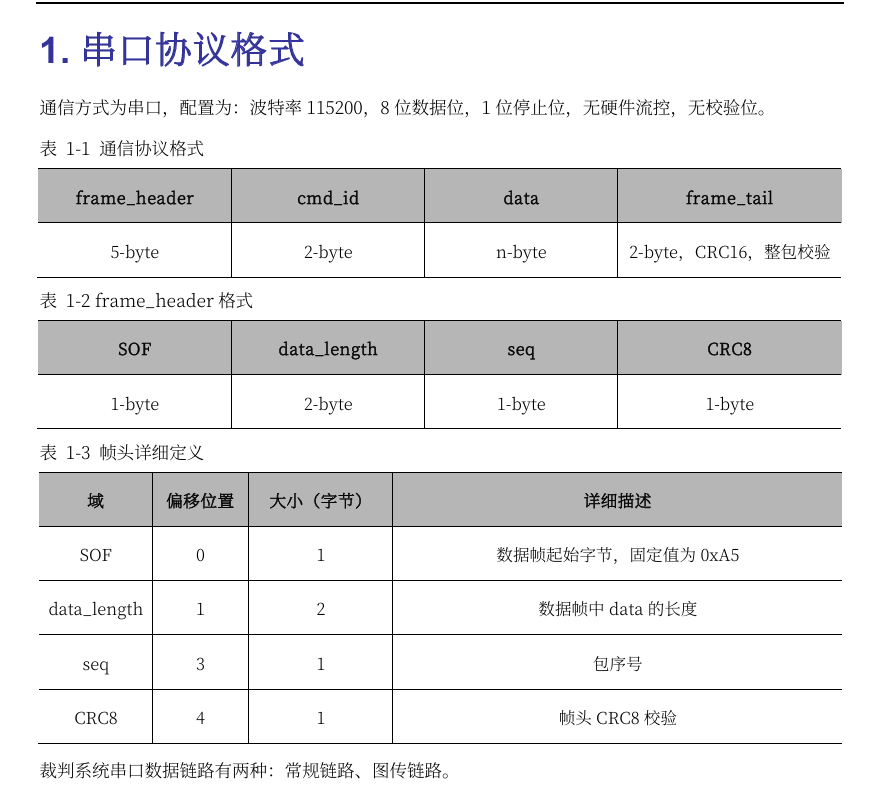

# UART
更多在这篇博客
https://blog.csdn.net/weixin_46061266/article/details/133465644?ops_request_misc=%257B%2522request%255Fid%2522%253A%25225ae5e0876c1f7f06d6b498278f2b07d6%2522%252C%2522scm%2522%253A%252220140713.130102334..%2522%257D&request_id=5ae5e0876c1f7f06d6b498278f2b07d6&biz_id=0&utm_medium=distribute.pc_search_result.none-task-blog-2~all~sobaiduend~default-1-133465644-null-null.142^v101^pc_search_result_base1&utm_term=UART%E4%B8%B2%E5%8F%A3%E5%8D%8F%E8%AE%AE&spm=1018.2226.3001.4187
+ 一种异步收发器，允许不同设备进行数据传输
+ TX和RX交叉接，同时必须共地，否则电平信号不统一，无法知道高低电平
+ 波特率、数据位、停止位和奇偶校验（crc更好）都要一样

# DMA
我们以DMA为例，进行演示
+ Direct Memory Access(直接存储器访问)
+ 一种硬件机制，允许外部设备直接与系统内存进行数据交换，无需CPU介入
+ 必须明确数据的源地址，数据传输位置的目标地址，传递数据多少的数据传输量，进行多少次传输的传输模式
+ DMA 控制器
有8个数据流,同时处理8个不同的数据传输任务
每个通道都有3个事件标志（DMA半传输、DMA传输完成和DMA传输出错）
源数据先送入FIFO，达到FIFO的触发阈值后，再传送到目标地址
DMA数据传输方式
普通模式
传输结束后（即要传输数据的数量达到零），将不再产生DMA操作。若要开始新的DMA传输，需在关闭DMA通道情况下，重新启动DMA传输
循环模式
循环模式：可用于处理环形缓冲区和连续数据流。每轮传输结束时，要传输的数据数量将自动用设置的初始值进行加载，并继续响应DMA请求
```
//初始化
void UART_Init(UART_HandleTypeDef *huart, UART_Call_Back Callback_Function, uint16_t Rx_Buffer_Length){
  //在接收到空闲信号后停止接收，并触发中断
  HAL_UARTEx_ReceiveToIdle_DMA();
  //避免半传输中断
  __HAL_DMA_DISABLE_IT(&hdma_usart1_rx, DMA_IT_HT);
}
//DMA 空闲中断
void HAL_UARTEx_RxEventCallback(UART_HandleTypeDef *huart, uint16_t Size)
```
# Dbus
+ 一种无线通信模式，Dbus协议在应用层
+ 我感觉跟其余通信没什么太大差别，可能多了一层无线，具体以后再补，看了好多资料，云里雾里的
# uart代码解析
数据流的角度看待，接收数据输入、处理数据并且产生数据输出的一种方式或者协议，根据上述模型，数据的传输是及其重要的事，
我们接下来根据代码来讲
```
void UART_Init(UART_HandleTypeDef *huart, UART_Call_Back Callback_Function, uint16_t Rx_Buffer_Length)
{
    if (huart->Instance == USART1)
    {
        UART1_Manage_Object.UART_Handler = huart;
        UART1_Manage_Object.Callback_Function = Callback_Function;
        UART1_Manage_Object.Rx_Buffer_Length = Rx_Buffer_Length;
        HAL_UARTEx_ReceiveToIdle_DMA(huart, UART1_Manage_Object.Rx_Buffer, UART1_Manage_Object.Rx_Buffer_Length);
			__HAL_DMA_DISABLE_IT(&hdma_usart1_rx, DMA_IT_HT);
    }
```
我们可以把can、uart、spi、iic这些通信协议当作传递数据的一种途径，首先进行初始化就是相当于搭建了一个通道允许发送方和接收方进行数据的交互，达到数据流的目的，传入的huart是一个句柄，判断是初始化哪个串口进行数据传输


对于一个数据流系统，它有输入、输出单元、控制单元、算术逻辑单元、存储器
+ 输入出部分
在本小节中，输出部分如下，这个函数，可以很清晰地知道进行什么数据的传输，我们看到return部分，这是一个DMA（direct memory access）传输，它的第一个形参是huart一个句柄，这是在初始化就提及的对特定的串口的开启，也可以看作是一次信息的筛选，跟后来的crc校验其实可以一起看作是对数据的预备发送处理工作；第二个形参，顾名思义就是想要传的数据；第三个数据是长度，要记得这里的长度并非是轮询或者串口模式下，自己固定传输多少数据，而是想要传输的最大数据
```
uint8_t UART_Send_Data(UART_HandleTypeDef *huart, uint8_t *Data, uint16_t Length)
{
    return (HAL_UART_Transmit_DMA(huart, Data, Length));
}
```
数据已经发送，接下来按理说是数据的传输过程，但是代码没有写，这里就不过多赘述.
接下来数据到了系统，这个时候就要请出控制单元和算术逻辑单元
当然这里的话，我们采用了空闲中断的模式，对数据控制和算术逻辑
```
void HAL_UARTEx_RxEventCallback(UART_HandleTypeDef *huart, uint16_t Size)
{    
    //停止DMA接收 保护处理过程
//    HAL_UART_DMAStop(huart);
    //选择回调函数
    if (huart->Instance == USART1)
    {
        UART1_Manage_Object.Rx_Length = Size;
        UART1_Manage_Object.Callback_Function(UART1_Manage_Object.Rx_Buffer, Size);
        HAL_UARTEx_ReceiveToIdle_DMA(huart, UART1_Manage_Object.Rx_Buffer, UART1_Manage_Object.Rx_Buffer_Length);//这个是再次开启空闲中断模式
				__HAL_DMA_DISABLE_IT(&hdma_usart1_rx, DMA_IT_HT);
    }
```
+ 存储器
这个时候我们不妨想一下，数据的输入和输出，它中间还要经过算术逻辑处理，如果数据处理要好多步的情况下，如果我们只用一个变量代替所有，它会有变量不够用的问题，在实际操作上，这是一个灾难，很显然，上述是废话，但我想说的是这个数据存储在哪的问题，这样虽然说没有什么营养，但是可以帮助我们更好的理解数据流
```
Struct_UART_Manage_Object UART1_Manage_Object = {0};

struct Struct_UART_Manage_Object
{
    UART_HandleTypeDef *UART_Handler;
    uint8_t Tx_Buffer[UART_BUFFER_SIZE];
    uint8_t Rx_Buffer[UART_BUFFER_SIZE];
    uint16_t Rx_Buffer_Length;
    uint16_t Tx_Buffer_Length;
    uint16_t Rx_Length;
    uint16_t Tx_Length;
    UART_Call_Back Callback_Function;
};
```
从上面的代码，我们发现，把数据存储的模块放在一个结构体中，进行打包，好像是一个不错的选择，这样我们就可以把所有的发送和接收数据的变量用一个整体UART1_Manage_Object给打包起来，这样可以简化数据流的操作，但是在这个代码中我们一般用class进行处理，它有着比struct更好的性能，它天然有private和public之分，我们可以这么想，数据的处理可以放到private里面，这样形成了一个封装，可以防止数据被污染
# dr16代码解析
    


