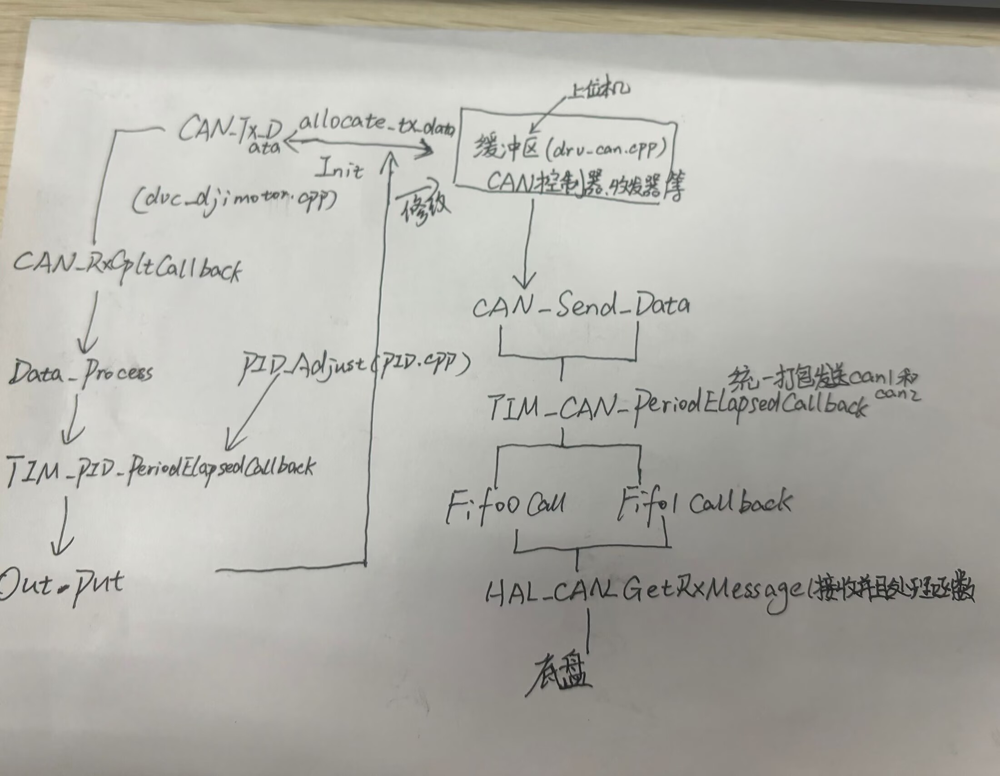
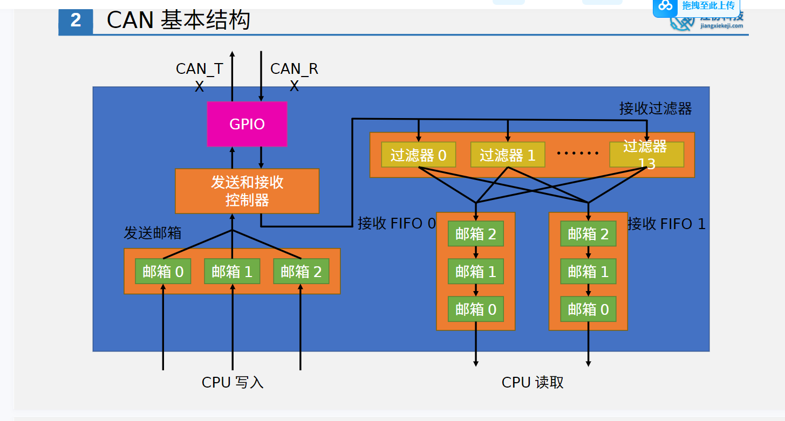
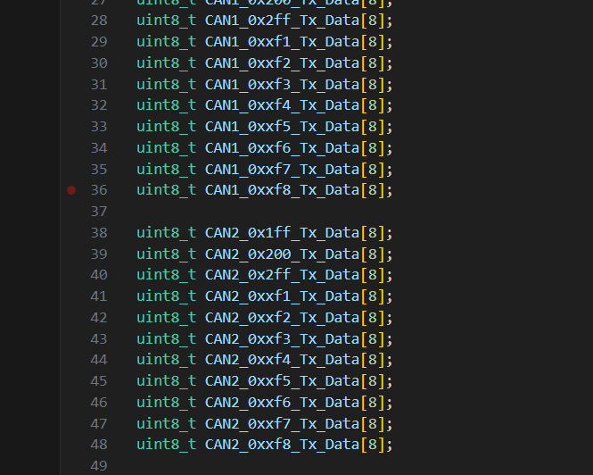
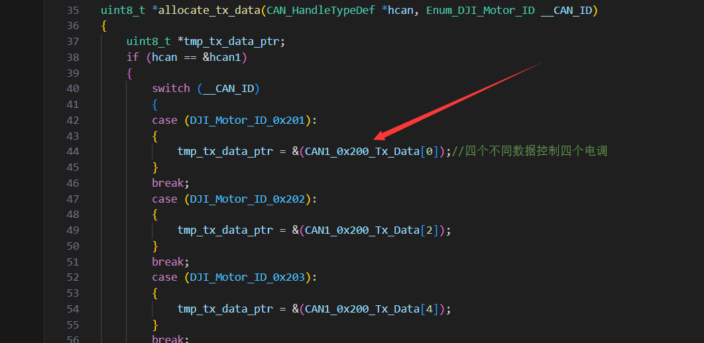
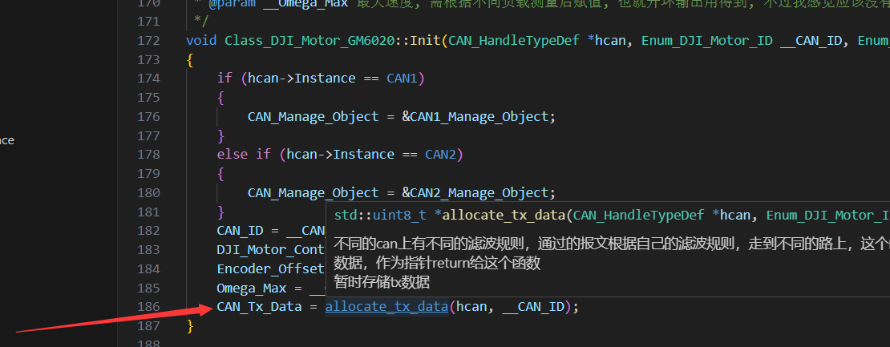

#代码逻辑框架(超简易版本)  

基于给定的三个文件：dvc_djimotor.cpp、drv_can.cpp、alg_pid.cpp
##drv_can.cpp  

从框架图中可以看到在缓冲区中，对于要发送的数据定义了其缓冲区数组   

对于这个缓冲区发送数组，它首先经过结构图上的过滤器，在代码中代表着经过can_filter_mask_config和CAN_Init，初始化并且配置CAN的过滤器结构体 

接下来我们来讨论一下在代码中的掩码模式，对于每一个报文，它首先与掩码帧按位与，得到的数据与掩码帧比较，如果相同，则报文可以通过；当然它还有一个列表模式，只有对每个ID的每一位数字相同，才能通过  

数据通过CAN_Send_Data进行缓冲区数据的解析和待发送，接下来通过TIM_CAN_PeriodElapsedCallback对can总线上的两个can发送数据，这个时候就到了发送完数据的地步了，接下来其实有个发送中断函数，但我没发现；接下来就有一个rx_buffer接收这个发送数据，接收完之后，有一个接收中断函数，分为FIFO0和1，在这个中断函数中进行接受函数并且处理函数，同时还有判断报文是否成功发送，0或1判断指令  

接下来就是简单数据的处理成功，它传给了C620，这个电子调速器进而在底盘解算后控制电机，让小车运动  
##dvc_djimotor.cpp  

首先来看下修改缓冲区结构  
  
  

  
首先tmp_tx_data_ptr以一个指针暂时指向缓冲区tx数据，tmp_tx_data_ptr这个作为返回值返回给*allocate_tx_data，然后CAN_Tx_Data指向*allocate_tx_data，最后Out(pid最后输出的)给到了CAN_Tx_Data  
总而言之，PID最后输出的out，给到了缓冲区tx，通过drv_can.cpp控制电机   

接下来走到了CAN_RxCpltCallback(uint8_t *Rx_Data)这个函数，因为在底盘控制之后，输出了一个rx_data数据，这个数据传到rx_data,之后进入了CAN_RxCpltCallback函数，这个是一个中断函数，接下来进入Data_Process函数，这个函数是对encoder模式的数据的解析，解析完了之后，这个编码器解析的数据就与上位机或者target数据结合，进入到了最主要的agl_pid.cpp文件中的TIM_Adjust_PeriodElapsedCallback函数，这个函数最后输出一个out  
这个就到了修改缓冲区3，把缓冲区的数据进行修改，这样就形成了一个PID闭环控制  
##总结  
总的来说，本次任务实现一个闭环控制代码，并进行PID调参，核心在于如何实现PID的target和now的处理，now的处理在于dvc_djimotor.cpp中的解析，target可多变，以上就是代码解析部分  

因为我的PID还没跑通，其余的也说不了啥

S